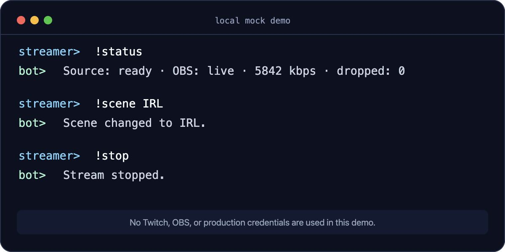

# RAZEX OBS Chat Control

A self-hosted remote control for IRL streams. An allow-listed Twitch user can start or stop OBS,
switch only approved scenes, and inspect the phone-to-OBS pipeline without opening a public admin
panel.



This is a clean public edition of a tool built for a real IRL streaming setup:

```text
phone (Moblin/SRTLA) → mediamtx → OBS → Twitch
                              ↑
                  EventSub chat commands
```

## Why this project exists

When the streamer is away from the PC, an OBS restart or scene switch should not require exposing
OBS WebSocket to the internet. This service listens through Twitch EventSub, verifies immutable user
IDs, and connects to OBS over a private path.

## Commands

| Command | Result |
| --- | --- |
| `!start` | Starts the OBS stream output. |
| `!stop` | Stops the OBS stream output. |
| `!status` | Reports mediamtx source presence, OBS state, bitrate, and dropped frames. |
| `!scene <name>` | Switches to a scene from the explicit configuration allow-list. |

Unauthorized commands receive no response. Network calls have timeouts, scene names cannot escape
the allow-list, and Twitch access/refresh tokens are stored in a mode-`0600` SQLite database.

## Stack and design

- Python 3.11+ with typed, testable domain logic
- TwitchIO 3 EventSub and managed OAuth refresh
- OBS WebSocket 5 through `simpleobsws`
- Optional mediamtx v3 status API
- Hardened `systemd` service with a dynamic non-root user
- Ruff, pytest, pip-audit, and a two-version GitHub Actions matrix

The TwitchIO 3 flow follows the current EventSub/API model instead of the legacy IRC-only client.
The first local OAuth authorization is interactive; later token refreshes are persisted automatically.

## Local setup

```bash
python3.11 -m venv .venv
source .venv/bin/activate
python -m pip install -e ".[dev]"
cp config.example.toml config.toml
chmod 600 config.toml
obs-chat-control --config "$PWD/config.toml" --database "$PWD/tokens.db"
```

Create a Twitch application and register `http://localhost:4343/oauth/callback`. On first start:

1. Sign in as the dedicated bot account and open
   `http://localhost:4343/oauth?scopes=user:read:chat%20user:write:chat%20user:bot&force_verify=true`.
2. Sign in as the broadcaster and open
   `http://localhost:4343/oauth?scopes=channel:bot&force_verify=true`.
3. Restart the service after both authorizations are stored.

Use `config.example.toml` as the contract. Never commit `config.toml` or `tokens.db`.

## Private OBS connection

Keep port `4455` on localhost or a private network. If OBS is behind NAT, a reverse SSH tunnel is a
small deployment option:

```bash
ssh -N -R 4455:127.0.0.1:4455 tunnel@your-server
```

For production, install the package under `/opt/obs-chat-control`, copy the example unit from
`deploy/obs-chat-control.service`, and put the configuration at
`/etc/obs-chat-control/config.toml` with mode `0600`.

## Checks

```bash
ruff check .
ruff format --check .
pytest
pip-audit
obs-chat-demo
```

The demo uses deterministic mock values and never connects to Twitch or OBS.

## Security boundaries

This project deliberately does not include production tokens, addresses, stream keys, or private
repository history. Read [SECURITY.md](SECURITY.md) before deployment. The public edition is useful
as an architecture reference, but every operator remains responsible for Twitch application scopes,
network segmentation, OBS authentication, and backups.

## License

MIT © Rasul Khattaev
